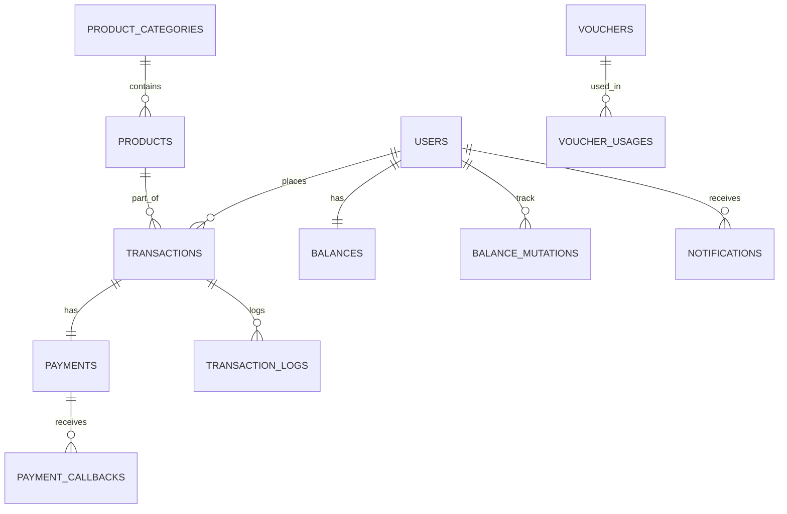

# Arsitektur Sistem & Struktur Database

## 🏗️ Gambaran Umum Arsitektur

Sistem ini dibangun sebagai backend Laravel yang terintegrasi dengan Docker, dengan frontend Next.js/Flutter (berbasis profile).

### Detail Layanan

- **Backend (PHP-FPM)**: Berjalan pada port 9000 (Internal), ditangani oleh Nginx pada port 8000.
- **Database (MySQL 8.0)**: Dapat diakses pada port 3307.
- **Redis**: Digunakan untuk caching dan manajemen antrian (queue) pada port 6379.
- **Queue Worker**: Menangani tugas latar belakang (misalnya, pemrosesan pesanan Digiflazz).
- **Scheduler**: Mengelola tugas terjadwal seperti sinkronisasi produk.

---

## 🗄️ Struktur Database

### Entity Relationship Diagram (ERD) Utama

### Definisi Tabel

#### 1. Users

Mengelola akun Guest, Retail, Reseller, dan Admin.

- `role`: admin, customer.
- `customer_type`: retail, reseller.
- `is_guest`: TRUE/FALSE.

#### 2. Products & Categories

- `products`: Terintegrasi dengan SKU Digiflazz. Mendukung harga bertingkat (retail vs reseller) dan field input dinamis.
- `product_categories`: Pengelompokan berdasarkan tipe (game, pulsa, dll).

#### 3. Transactions & Payments

- `transactions`: Log pusat untuk pembelian dan top-up.
- `payments`: Melacak status dan metode pembayaran gateway (Tripay) (QRIS, VA, dll).
- `balance_mutations`: Riwayat detail semua pergerakan saldo untuk reseller.

#### 4. System Logs

- `activity_logs`: Tindakan sistem secara umum.
- `transaction_logs`: Transisi status spesifik untuk pesanan.

---

## 🔄 Alur Data Utama

### Alur Permintaan API

1. Permintaan Pengguna → Backend Nginx (8000)
2. Nginx → PHP-FPM (Backend)
3. Backend → MySQL/Redis
4. Respon → Pengguna

### Alur Pemrosesan Pesanan (Digiflazz)

1. Pembayaran PAID (melalui Callback Tripay)
2. Memicu Job `ProcessDigiflazzOrder`
3. Job dimasukkan ke Antrian Redis
4. Queue Worker mengeksekusi job → Memanggil API Digiflazz
5. SN (Serial Number) diterima → Selesaikan Transaksi
6. Notifikasi ke Pengguna
