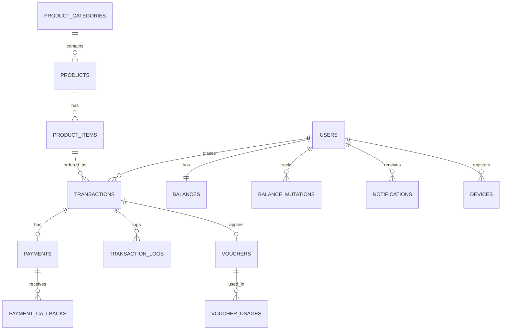

# Arsitektur Sistem & Struktur Database

## 🏗️ Gambaran Umum

Sistem ini terdiri dari tiga aplikasi terpisah yang terintegrasi:

| Aplikasi     | Teknologi        | Fungsi                                     |
| ------------ | ---------------- | ------------------------------------------ |
| **Backend**  | Laravel 12 + PHP | API REST, business logic, queue, scheduler |
| **Frontend** | Next.js (React)  | Web app untuk customer & reseller          |
| **Mobile**   | Flutter (Dart)   | Aplikasi mobile Android/iOS                |

### Infrastruktur (Docker)

| Layanan      | Port Internal | Port Eksternal | Keterangan                    |
| ------------ | ------------- | -------------- | ----------------------------- |
| Nginx        | 80            | 8000           | Reverse proxy ke PHP-FPM      |
| PHP-FPM      | 9000          | -              | Runtime Laravel               |
| MySQL 8.0    | 3306          | 3307           | Database utama                |
| Redis        | 6379          | 6379           | Cache & antrian job           |
| Queue Worker | -             | -              | Proses job latar belakang     |
| Scheduler    | -             | -              | Cron jobs (sync produk, dll.) |

---

## 🗄️ Struktur Database

### Entity Relationship Diagram (ERD)



### Definisi Tabel Utama

#### Users

| Kolom           | Tipe    | Keterangan                       |
| --------------- | ------- | -------------------------------- |
| `role`          | enum    | `admin`, `customer`              |
| `customer_type` | enum    | `retail`, `reseller`             |
| `is_guest`      | boolean | TRUE jika checkout tanpa daftar  |
| `referral_code` | string  | Kode unik untuk program referral |

#### Products & Product Items

- `products`: Produk induk (Mobile Legends, XL Pulsa, dll.) dengan integrasi SKU Digiflazz, field input dinamis (`input_fields`), dan pengelompokan kategori.
- `product_items`: Varian/denominasi dari sebuah produk. Menyimpan tiga level harga:

| Kolom             | Keterangan                                      |
| ----------------- | ----------------------------------------------- |
| `base_price`      | Harga beli dari Digiflazz                       |
| `retail_price`    | Harga jual ke customer retail                   |
| `reseller_price`  | Harga jual ke reseller (lebih murah)            |
| `retail_profit`   | Margin keuntungan retail (disimpan untuk audit) |
| `reseller_profit` | Margin keuntungan reseller                      |
| `price`           | Field virtual — diisi accessor, bukan kolom DB  |

> [!NOTE]
> Field `price` **bukan kolom database**. Ia dibuat secara dinamis oleh `getPriceAttribute()` pada model `ProductItem` dan di-append ke JSON response via `$appends = ['price']`.

#### Transactions

| Kolom                 | Keterangan                                                   |
| --------------------- | ------------------------------------------------------------ |
| `transaction_code`    | Kode unik (format: `TRX-XXXXXXXX`)                           |
| `customer_type`       | Snapshot tipe akun saat transaksi dibuat                     |
| `product_price`       | Harga produk yang berlaku saat itu                           |
| `admin_fee`           | Biaya gateway Tripay (diperbarui setelah API call)           |
| `discount_amount`     | Nominal diskon dari voucher (0 jika tidak ada)               |
| `total_price`         | Total final yang dibayarkan user                             |
| `payment_method_type` | `gateway` (Tripay) atau `balance` (saldo)                    |
| `status`              | Status pesanan: `pending`, `processing`, `success`, `failed` |
| `payment_status`      | Status pembayaran: `pending`, `paid`, `expired`              |

---

## 🔄 Alur Data Utama

### Alur Request API

```
Client (Browser/App)
  → Nginx (port 8000)
  → PHP-FPM (Laravel)
  → MySQL / Redis
  → Response
```

### Alur Pemrosesan Pesanan (Prepaid)

```
1. User bayar → Tripay konfirmasi
2. Tripay kirim callback ke POST /api/webhooks/tripay
3. Backend validasi signature HMAC
4. Status payment → paid
5. Job ProcessDigiflazzOrder didispatch ke antrian Redis
6. Queue Worker eksekusi job → panggil API Digiflazz
7. Digiflazz kirim SN ke callback
8. Transaksi selesai → notifikasi ke user
```

### Alur Sinkronisasi Produk

```
php artisan digiflazz:sync-products
  → Ambil daftar produk dari Digiflazz API
  → Hitung retail_price = base_price + (base_price × retail_margin%)
  → Hitung reseller_price = base_price + (base_price × reseller_margin%)
  → Update/Insert ke tabel product_items
```
